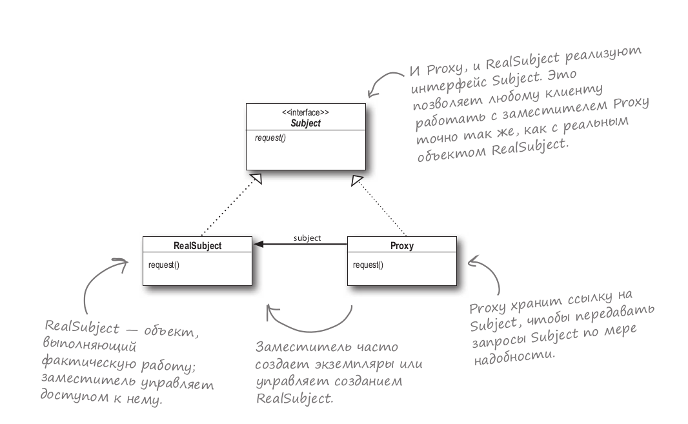

## Паттерн Заместитель.
### Классификация - паттерн, структурирующий объекты.

`
Паттерн Заместитель предоставляет суррогатный объект, управляющий доступом к другому объекту.
`

Является суррогатом другого объекта и контролирует доступ к нему.

Использовать паттерн Заместитель дл создания объекта, управляющего доступом к другому объекту - удаленному, защищенному,
требующему слишком больших затрат при создании:
- Удаленный Заместитель управляет доступом к удаленному объекту (предоставляет локального представителя вместо объекта, 
находящегося в другом адресном пространстве);
- Виртуальный Заместитель управляет доступом к ресурсу, создание которого требует больших затрат и ресурсов (создает
тяжелые объекты по требованию);
- Защищающий Заместитель контролирует доступ к ресурсу в соответствии с системой привилегий (такие заместители полезны,
когда для разных объектов определены различные права доступа);

Диаграмма классов

Subject - субъект. Определяет общий для RealSubject и Proxy интерфейсы.

RealSubject - реальный субъект. Выполняет фактическую работу.

Proxy - заместитель:
- хранит ссылку на RealSubject. Объект Proxy может обращаться к объекту класса Subject (если интерфейсы у Subject и 
RealSubject одинаковы);
- предоставляет интерфейс, идентичный интерфейсу RealSubject, так что заместитель всегда может быть подставлен вместо
реального субъекта;
- контролирует доступ к реальному субъекту и может отвечать за его создание и удаление;
- прочие обязанности зависят от вида заместителя (удаленный отвечает за кодирование запроса и его аргументов и 
отправление закодированного запроса реальному субъекту в другом адресном пространстве; виртуальный может кешировать 
дополнительную информацию о реальном субъекте, чтобы отложить его создание; защищающий проверяет, имеет ли вызывающий
объект необходимые для выполнения запроса права).