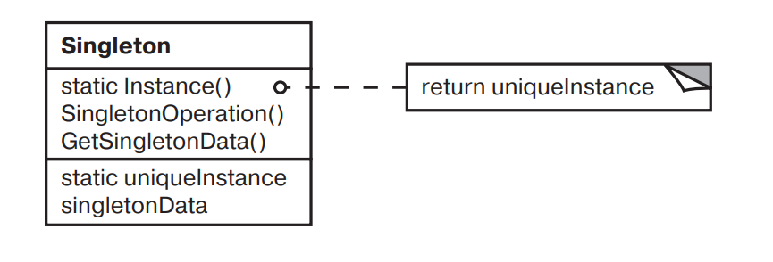

## Паттерн Одиночка.
### Классификация - порождающий.

#### Назначение
Паттерн Одиночка гарантирует, что класс имеет только один экземпляр, и предоставляет глобальную точку доступа к
этому экземпляру.

#### Применимость:
Используйте паттерн Одиночка, когда:
- Должен быть ровно один экземпляр некоторого класса, лего доступный всем клиентам;
- Единственный экземпляр должен расширяться путем порождения подклассов, и клиентам нужно иметь возможность работать с
расширенным экземпляром без модификации своего кода.


#### Структура:



#### Пример
```php
class Singleton
{
    private static $instance;
    private array $props = [];

    static public function getInstance()
    {
        if (empty(static::$instance)) {
            static::$instance = new static();
        }

        return static::$instance;
    }
    
    private function __construct() {}

    private function __clone() {}

    private function __wakeup() {}

    public function setProperty(string $key, string $value)
    {
        $this->props[$key] = $value;
    }
    
    public function getProperty(string $key)
    {
        return $this->props[$key];
    }
}
```

#### Выводы.
Одиночка решает сразу две проблемы, нарушая принцип единой ответственности класса:
- Гарантирует наличие единственного экземпляра класса. Чаще всего это полезно для доступа к какому-то общему ресурсу,
например, базе данных;
- Предоставляет глобальную точку доступа. Это не просто глобальная переменная, через которую можно достучаться к
определенному объекту. Глобальные переменные не защищены от записи, поэтому любой код может подменять их значения без
вашего ведома.

Наверно лучше делать трейт.