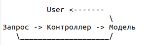

### Controller (Контроллер)

Отвечает за операции, запросы на которые приходят от пользователя, и может выполнять сценарии одного или нескольких вариантов использования (например, создание и удаление);

Не выполняет работу самостоятельно, а делегирует компетентным исполнителям;

Может представлять собой:
- Систему в целом;
- Подсистему;
- Корневой объект;
- Устройство.


Пример:
```php
class Post extends ActiveRecord
{
    // ...

    public function beforeSave($insert)
    {
        if (parent::beforeSave($insert)) {
            if ($insert) {
                $this->user_id = Yii::$app->user->id;
                $this->user_ip = Yii::$app->request->userIP;
                $this->created_at = time();
            }
            return true;
        }
        return false;
    }
}

class PostController extends Controller
{
    public function actionCreate()
    {
        $model = new Post();

        if ($model->load(Yii::$app->request->post()) && $model->save()) {
            return $this->redirect(['view', 'id' => $model->id]);
        }

        return $this->render('create', [
            'model' => $model,
        ]);
    }
}
```

Вроде нормально, НО!

Запрос приходит к контроллеру, контроллер передает данные модели...
И модель лезет в компонент "Пользователь" для получения идентификатора пользователя и в компонент "Запрос" для
получения ip откуда пришел запрос.

И получается такая странная картина:



Возможные ошибки: кто-то пытается сохранить модель через консоль, и система валится, так как в консоли нет ip и user.

Лучше сделать так:
```php
class Post extends ActiveRecord
{
    // ...

    public function beforeSave($insert)
    {
        if (parent::beforeSave($insert)) {
            if ($insert) {
                $this->created_at = time();
            }
            return true;
        }
        return false;
    }
}

class PostController extends Controller
{
    public function actionCreate()
    {
        $model = new Post();
        $model->user_id = Yii::$app->user->id;
        $model->user_ip = Yii::$app->request->userIP;

        if ($model->load(Yii::$app->request->post()) && $model->save()) {
            return $this->redirect(['view', 'id' => $model->id]);
        }

        return $this->render('create', [
            'model' => $model,
        ]);
    }
}
```

В этом случае контроллер передает все данные, которые нужны для модели.

    Запрос -> Контроллер -> Модель
___
