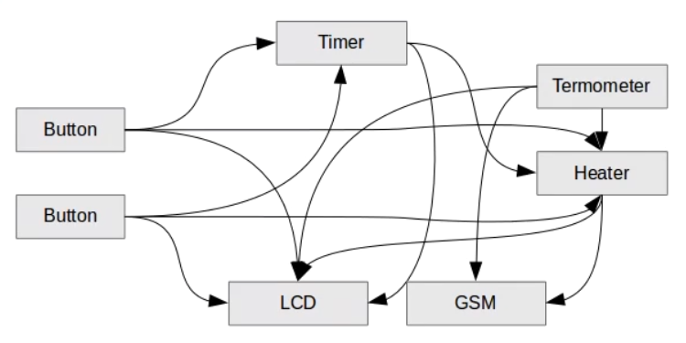
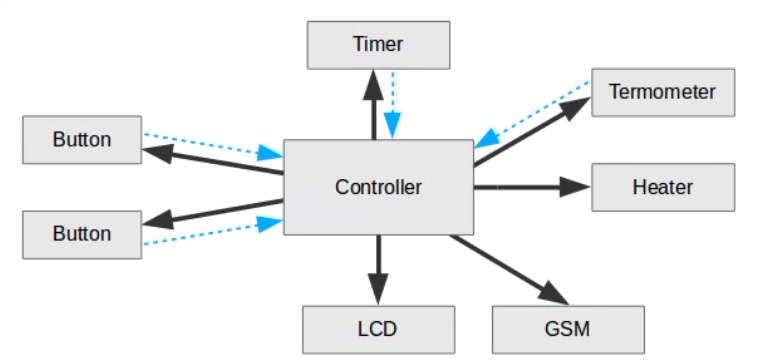

### Low Coupling (Низкая связанность)

В системе между разными модулями (компонентами, классами, объектами) должна быть низкая связанность.

В какой-то момент, если в системе много компонентов, может возникнуть такая ситуация:

Нужно сделать чтоб связи шли либо в одну сторону, либо посредника:

