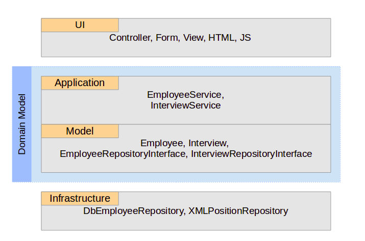

## Урок 6. Практика: Как написать программу.

Что важно для заказчика
Что важно для программиста
Плюсы и минусы ActiveRecord и CRUD
Куда поместить бизнес-логику... и прочие вещи.

Примером будет проект "Автоматизация приема сотрудников на работу, установка
им зарплаты и так далее" (автоматизация отдела кадров).

Сначала попробуем разработать проект по принципу database-first.

[Схема таблиц проекта](db_schema.md). Для каждого типа приказа свой таблица,
а нумерация и дата приказа хранится в таблице `order`, чтобы была сквозная
нумерация для всех приказов.

Придем к пониманию, что в этом случае возникнут проблемы, и попробуем уйти
от принципа database-first на code-first.

Реализованы модели, контроллеры, формы для системы.

Также реализована логика отправки письма и логирование, отображение разного списка статусов интервью.
Также реализован логика создания связанных данных при приеме сотрудника на работу, отправка письма и логирование.


До коммита `91ff9da63e6039df643330e6b7e09e28ee92016d` или в ветке `badcode` реализовано как это делается "обычно, 
неопытным программистом".

В итоге получилось:
- огромные модели;
- сложные правила валидации на все случаи жизни;
- сложные контроллеры;
- не тестируемый код.

___


```txt
создание   \             / отправить письмо "вы приняты"
обновление ---- save() --- отправить письмо "вы повышены"
изменение  /             \ отправить письмо "вы в отпуске"
```

В ветке `badcode` проекта использованы только CRUD.

Мы пытаемся уместить в парадигму CRUD бизнес задачи.
```txt
Сотрудники
    - Создать
    - Редактировать
    - Удалить
    
Собеседования
    - Создать
    - Редактировать
    - Удалить
```

___
### Как это изменить?
Нужно продумать с точки зрения бизнеса.
```txt
- Пригласить на собеседование
- Пройти собеседование
- Отклонить собеседование
- Принять сотрудника
- Назначить сотрудника
- Отправить в отпуск
- Назначить премию
- Уволить
```

Если рассмотреть интервью как объект, то можно для него сделать методы:
```txt
1 -   join()   - 1
2 -   edit()   - 2
3 -   move()   - 3
4 -   pass()   - 4
5 -   reject() - 5
```
___

#### Пригласить на собеседование
Вынести в отдельный метод `пригласить на собеседование`. Так как для приглашения человека на
собеседование могут потребоваться не все поля, то сделать отдельную модель для валидации.
```php
$interview = Interview::join($date, $lastName, $firstName, $email);

 class InterviewJoinForm extends Model
 {
     public $date;
     public $lastName;
     public $firstName;
     public $email;

     public function rules() {
         return [
             [['date', 'lastName', 'firstName', 'email'], 'required']
         ];
     }
 }
```

Почему статический метод? Потому что может быть несколько вариантов создания.

Реализация представлена в ветке `refactoring/v1`
___
#### Пройти собеседование
```php
$employee = Employee::create(...);
$interview->passBy($employee);
```


___
#### Отклонить собеседование
```php
$interview->reject($reason);

 class InterviewRejectForm extends Model
 {
     public $reason;

     public function rules() {
         return [
             ['reason' , 'required']
         ];
     }
 }
```

Реализация логики отклонения собеседования в ветке `refactoring/v2`.

Реализации логики переноса и удаления собеседования в ветке `refactoring/v3`.
___

Логирование и отправка письма вынесены из StarrService в классы Logger и Notifier (при инициализации приложения
помещаются в di). Реализация в ветке `refactoring/v4`.

___
#### Принять сотрудника
```php
$employee = Employee::create(...);
```
___
#### Назначить сотрудника
```php
$assignment = Assignment::assign($emplyee, $position, $date);
```
___

Конечный вариант приложения в ветке `refactoring/v5`.

___

## 

Например есть модель `Order`. Как можно изменить значения свойства модели?
```php
class Order extends ActiveRecord
{
    const STATUS_NEW = 0;
    const STATUS_PAID = 1;
    const STATUS_SENT = 2;
}
#######################################
$order = $this->findModel(5);
#######################################
$order->status = Order::STATUS_PAID;
$order->save();

$order->updateAttributes(['status' => Order::STATUS_PAID]);

Order::updateAll(['status' => Order::STATUS_PAID], ['id' => $order->id]);

Yii::$app->db
    ->createCommand()
    ->update(Order::tableName(), ['status' => Order::STATUS_PAID], ['id' => $order->id])
    ->execute();
```

Чем плохо в случае, когда можно несколькими способами сделать одно и то же?
Например нужно отправить письмо после изменения статуса заказа. Кто то возьмет и сделает в методе `afterSave()`:
```php
class Order extends ActiveRecord
{
    const STATUS_NEW = 0;
    const STATUS_PAID = 1;
    const STATUS_SENT = 2;

    public function afterSave($insert, $changedAttributes)
    {
        if (array_key_exists('status', $changedAttributes)) {
            Yii::$app->mailer->compose()->setSubject('Статус заказа изменён!')->setTo($this->email)->send();
        }
        parent::afterSave($insert, $changedAttributes);
    }
}
```

И в этом случае остальное 3/4 не сработают. Но в идеале нужно сделать так, чтобы можно было менять только по 1му методу.

Например, можно сделать метод `changeStatus()` и всех программистов заставить использовать этот метод:
```php
class Order extends ActiveRecord
{
    const STATUS_NEW = 0;
    const STATUS_PAID = 1;
    const STATUS_SENT = 2;

    public function changeStatus($status)
    {
        if ($status !== $this->status) {
            $this->status = $status;
            $this->updated_at = time();
            if ($this->save()) {
                Yii::$app->mailer->compose()->setSubject('Статус заказа изменён!')->setTo($this->email)->send();
                return true;
            }
        }
        return false;
    }
}
#######################################
$order = $this->findModel(5);
$order->changeStatus(Order::STATUS_PAID);
```

Но в таком случае непонятно как сделать так, чтобы на каждый статус отправлялось свое письмо (switch не вариант).

Вместо этого можно для каждого статуса сделать свой метод:
```php
class Order extends ActiveRecord
{
    const STATUS_NEW = 0;
    const STATUS_PAID = 1;
    const STATUS_SENT = 2;

    public function pay(DateTime $date)
    {
        if ($this->status === self::STATUS_NEW) {
            $this->status = self::STATUS_PAID;
            $this->paid_at = $date->getTimestamp();
            $this->updated_at = time();
            if ($this->save()) {
                Yii::$app->mailer->compose()->setSubject('Ваш заказ оплачен!')->setTo($this->email)->send();
                return true;
            }
        }
        return false;
    }

    public function send(DateTime $date)
    {
        if ($this->status !== self::STATUS_SENT) {
            $this->status = self::STATUS_SENT;
            $this->sent_at = $date->getTimestamp();
            $this->updated_at = time();
            if ($this->save()) {
                Yii::$app->mailer->compose()->setSubject('Ваш заказ отправлен!')->setTo($this->email)->send();
                return true;
            }
        }
        return false;
    }
}
#######################################
$order = $this->findModel(5);

$order->pay(new DateTime());
$order->send(DateTime::createFromFormat('2015-08-12', 'Y-m-d'));
```

Добавить проверку и вынести отправку письма из модели:
```php
class Order extends ActiveRecord
{
    const STATUS_NEW = 0;
    const STATUS_PAID = 1;
    const STATUS_SENT = 2;

    public function pay(DateTime $date)
    {
        if ($this->status === self::STATUS_PAID) {
            throw new \DomainException('Заказ уже оплачен');
        }
        $this->status = self::STATUS_PAID;
        $this->paid_at = $date->getTimestamp();
        $this->updated_at = time();
        if (!$this->save()) {
            throw new \RuntimeException('Ошибка сохранения');
        }
    }

    public function send(DateTime $date)
    {
        if ($this->status === self::STATUS_SENT) {
            throw new \DomainException('Заказ уже отправлен');
        }
        $this->status = self::STATUS_SENT;
        $this->sent_at = $date->getTimestamp();
        $this->updated_at = time();
        if (!$this->save()) {
            throw new \RuntimeException('Ошибка сохранения');
        }
    }
}
#######################################
class OrderController extends Controller
{
    public function actionPay($id)
    {
        $order = $this->findModel($id);
        try {
            $order->pay(new DateTime());
            Yii::$app->mailer->compose()
                ->setSubject('Ваш заказ оплачен!')
                ->setTo($order->email)
                ->send();
        } catch (\DomainException $e) {
            Yii::$app->session->setFlash('error', $e->getMessage());
        }
        return $this->redirect(['view', 'id' => $id]);
    }

    private function findModel($id)
    {
        if (!$order = Order::findOne($id)) {
            throw new NotFoundHttpException('Заказ не найден');
        }
        return $order;
    }
}
```

Но в этом случае неудобно то, что каждый вызов метода `pay()` или `send()` сохраняет модель в базу.
Неудобно тестировать. Также может быть такое, что нужно вызывать методы последовательно.
```php
$order->pay();
$order->send();
```

В этом случае при каждом вызове идет сохранение БД (нужно будет даже в транзакцию оборачивать...).

Вместо этого можно сохранение вынести в контроллер:
```php
class Order extends ActiveRecord
{
    const STATUS_NEW = 0;
    const STATUS_PAID = 1;
    const STATUS_SENT = 2;

    public function pay(DateTime $date)
    {
        if ($this->status === self::STATUS_PAID) {
            throw new \DomainException('Заказ уже оплачен');
        }
        $this->status = self::STATUS_PAID;
        $this->paid_at = $date->getTimestamp();
        $this->updated_at = time();
    }

    public function send(DateTime $date)
    {
        if ($this->status === self::STATUS_SENT) {
            throw new \DomainException('Заказ уже отправлен');
        }
        $this->status = self::STATUS_SENT;
        $this->sent_at = $date->getTimestamp();
        $this->updated_at = time();
    }
}
#######################################
class OrderWebController extends \yii\web\Controller
{
    public function actionPay($id)
    {
        $order = $this->findModel($id);
        try {
            $order->pay(new DateTime());
            $this->save($order);
            Yii::$app->mailer->compose()
                ->setSubject('Ваш заказ оплачен!')
                ->setTo($order->email)
                ->send();
        } catch (\DomainException $e) {
            Yii::$app->session->setFlash('error', $e->getMessage());
        }
        return $this->redirect(['view', 'id' => $id]);
    }

    private function findModel($id)
    {
        if (!$order = Order::findOne($id)) {
            throw new NotFoundHttpException('Заказ не найден');
        }
        return $order;
    }

    private function save(Order $order)
    {
        if (!$order->save()) {
            throw new \RuntimeException('Ошибка сохранения');
        }
    }
}
```

Все вроде норм. Но что будет если два приложения? web и api. И есть еще rest контроллер для заказа:
```php
class OrderRestController extends \yii\rest\Controller
{
    public function actionPay($id)
    {
        $order = $this->findModel($id);
        $order->pay(new DateTime());
        $this->save($order);
        Yii::$app->mailer->compose()
            ->setSubject('Ваш заказ оплачен!')
            ->setTo($order->email)
            ->send();
        return $order;
    }

    private function findModel($id)
    {
        if (!$order = Order::findOne($id)) {
            throw new NotFoundHttpException('Заказ не найден');
        }
        return $order;
    }

    private function save(Order $order)
    {
        if (!$order->save()) {
            throw new \RuntimeException('Ошибка сохранения');
        }
    }
}
```

Получилось так, что метод `actionPay()` чуть отличается, но большая часть повторяется.

Чтобы не копировать методы `findModel()`, `save()` можно вынести их в отдельный репозиторий:
```php
class OrderRepository
{
    public function find($id) {
        if (!$order = Order::findOne($id)) {
            throw new NotFoundException('Заказ не найден');
        }
        return $order;
    }

    public function save(Order $order) {
        if (!$order->save()) {
            throw new \RuntimeException('Ошибка сохранения');
        }
    }
}
```

Также `mailer` подключить через контейнер зависимости.

Тогда в контроллерах останется:
```php
class OrderWebController extends \yii\web\Controller
{
    private $repository;
    private $mailer;

    public function __construct($id, $module, OrderRepository $repository, MailerInterface $mailer, $config = [])
    {
        $this->repository = $repository;
        $this->mailer = $mailer;
        parent::__construct($id, $module, $config = []);
    }

    public function actionPay($id)
    {
        $order = $this->repository->find($id);
        try {
            $order->pay(new DateTime());
            $this->repository->save($order);
            $this->mailer->compose()->setSubject('Ваш заказ оплачен!')->setTo($order->email)->send();
        } catch (\DomainException $e) {
            Yii::$app->session->setFlash('error', $e->getMessage());
        }
        return $this->redirect(['view', 'id' => $id]);
    }
}

class OrderRestController extends \yii\rest\Controller
{
    private $repository;
    private $mailer;

    public function __construct($id, $module, OrderRepository $repository, MailerInterface $mailer, $config = [])
    {
        $this->repository = $repository;
        $this->mailer = $mailer;
        parent::__construct($id, $module, $config = []);
    }

    public function actionPay($id)
    {
        $order = $this->repository->find($id);
        $order->pay(new DateTime());
        $this->repository->save($order);
        $this->mailer->compose()->setSubject('Ваш заказ оплачен!')->setTo($order->email)->send();
            
        return $order;
    }
}
```

Часть кода в rest и web контроллерах повторяется:
```php
        $order = $this->repository->find($id);
        $order->pay(new DateTime());
        $this->repository->save($order);
        $this->mailer->compose()->setSubject('Ваш заказ оплачен!')->setTo($order->email)->send();
```

Если поменяется текст письма, нужно будет это менять в нескольких местах.

Можно использовать сервис. Взять повторяющийся код из контроллеров и вынести его в сервис:
```php
class OrderService
{
    private $repository;
    private $mailer;

    public function __construct(OrderRepository $repository, MailerInterface $mailer)
    {
        $this->repository = $repository;
        $this->mailer = $mailer;
    }

    public function pay($id, DateTime $date)
    {
        $order = $this->repository->find($id);
        $order->pay($date);
        $this->repository->save($order);
        $this->mailer->compose()
            ->setSubject('Ваш заказ оплачен!')
            ->setTo($order->email)
            ->send();
    }
}
```

Тогда код в контроллерах станет таким:
```php
class OrderWebController extends \yii\web\Controller
{
    private $service;

    public function __construct($id, $module, OrderService $service, $config = [])
    {
        $this->service = $service;
        parent::__construct($id, $module, $config = []);
    }

    public function actionPay($id)
    {
        try {
            $this->service->pay($id, new DateTime());
        } catch (\DomainException $e) {
            Yii::$app->session->setFlash('error', $e->getMessage());
        }
        return $this->redirect(['view', 'id' => $id]);
    }
}

class OrderRestController extends \yii\rest\Controller
{
    private $service;

    public function __construct($id, $module, OrderService $service, $config = [])
    {
        $this->service = $service;
        parent::__construct($id, $module, $config = []);
    }

    public function actionPay($id)
    {
        $this->service->pay($id, new DateTime());
        return $this->redirect(['view', 'id' => $id]);
    }
}
```

Для отправки письма можно использовать события. Для этого:
- Создать события для каждого действия:
```php
abstract class Event { }

class OrderPayEvent extends Event
{
    public $order;
    public function __construct(Order $order)
    {
        $this->order = $order;
    }
}

class OrderSendEvent extends Event
{
    public $order;
    public function __construct(Order $order)
    {
        $this->order = $order;
    }
}
```

- Сделать обработчик события:
```php
class OrderPayListener
{
    private $mailer;

    public function __construct(MailerInterface $mailer)
    {
        $this->mailer = $mailer;
    }

    public function handle(OrderPayEvent $event)
    {
        $this->mailer->compose()
            ->setSubject('Ваш заказ оплачен!')
            ->setTo($event->order->email)
            ->send();
    }
}
```

- В сервисе кидать событие:
```php
class EventDispatcher
{
    public function dispatch(Event $event) { }
}

class OrderService
{
    private $repository;
    private $dispatcher;

    public function __construct(OrderRepository $repository, EventDispatcher $dispatcher)
    {
        $this->repository = $repository;
        $this->dispatcher = $dispatcher;
    }

    public function pay($id, DateTime $date)
    {
        $order = $this->repository->find($id);
        $order->pay($date);
        $this->repository->save($order);
        $this->dispatcher->dispatch(new OrderPayEvent($order));
    }
}
```


Есть альтернатива обработки событий.

Сейчас каждое событие генерируется внутри сервиса:
```php
$this->dispatcher->dispatch(new OrderPayEvent($order));
```

Чтобы генерацию событий делать не снаружи, можно перенести их внутрь модели `Order` 
(например нужно передать еще какие-то приватные данные заказа, которые снаружи недоступны).
Нужно сделать так, чтобы события генерировались внутри Order, а обрабатывались уже после сохранения
(чтоб не было такого что сообщение ушло, а заказ не сохранился).

Добавить приватное свойство для хранения событий:
```php
class Order extends ActiveRecord
{
    private $events = [];

    private function recordEvent(Event $event) {
        $this->events[] = $event;
    }

    public function releaseEvents() {
        $events = $this->events;
        $this->events = [];
        return $events;
    }

    const STATUS_NEW = 0;
    const STATUS_PAID = 1;
    const STATUS_SENT = 2;

    public function pay(DateTime $date)
    {
        if ($this->status === self::STATUS_PAID) {
            throw new \DomainException('Заказ уже оплачен');
        }
        $this->status = self::STATUS_PAID;
        $this->paid_at = $date->getTimestamp();
        $this->updated_at = time();
        $this->recordEvent(new OrderPayEvent($this));
    }

    public function send(DateTime $date)
    {
        if ($this->status === self::STATUS_SENT) {
            throw new \DomainException('Заказ уже отправлен');
        }
        $this->status = self::STATUS_SENT;
        $this->sent_at = $date->getTimestamp();
        $this->updated_at = time();
        $this->recordEvent(new OrderSendEvent($this));
    }
}
```

Добавить метод dispatchAll():
```php
class EventDispatcher
{
    public function dispatchAll(array $events) {
        foreach ($events as $event) {
            $this->dispatch($event);
        }
    }

    public function dispatch(Event $event) { }
}
```

Которому передать все события:
```php
class OrderService
{
    private $repository;
    private $dispatcher;

    public function __construct(OrderRepository $repository, EventDispatcher $dispatcher)
    {
        $this->repository = $repository;
        $this->dispatcher = $dispatcher;
    }

    public function pay($id, DateTime $date)
    {
        $order = $this->repository->find($id);
        $order->pay($date);
        $this->repository->save($order);
        $this->dispatcher->dispatchAll($order->releaseEvents());
    }
}
```

Ну еще можно использовать трейт и интерфейс, чтобы приватный массив $events использовать в
нескольких моделях:
```php
interface AggregateRoot
{
    public function releaseEvents();
}

trait EventTrait
{
    private $events = [];

    private function recordEvent(Event $event) {
        $this->events[] = $event;
    }

    public function releaseEvents() {
        $events = $this->events;
        $this->events = [];
        return $events;
    }
}

class Order extends ActiveRecord implements AggregateRoot
{
    use EventTrait;

    const STATUS_NEW = 0;
    const STATUS_PAID = 1;
    const STATUS_SENT = 2;

    public function pay(DateTime $date)
    {
        if ($this->status === self::STATUS_PAID) {
            throw new \DomainException('Заказ уже оплачен');
        }
        $this->status = self::STATUS_PAID;
        $this->paid_at = $date->getTimestamp();
        $this->updated_at = time();
        $this->recordEvent(new OrderPayEvent($this));
    }

    public function send(DateTime $date)
    {
        if ($this->status === self::STATUS_SENT) {
            throw new \DomainException('Заказ уже отправлен');
        }
        $this->status = self::STATUS_SENT;
        $this->sent_at = $date->getTimestamp();
        $this->updated_at = time();
        $this->recordEvent(new OrderSendEvent($this));
    }
}
```
___

Модель это не только ActiveRecord.




